Huxley-Gödel Machine

Human-Level Coding Agent Development by an Approximation of the Optimal Self-Improving Machine

KAUST, 2025

---

# The Challenge

🎯

Central Question

Which self-modifications should we accept?

⌠Prior Approach

DGM & SICA use benchmark scores

Assume: High score → Better lineage

⚠️ The Problem

High scores ≠ Good descendants

---

# Metaproductivity-Performance Mismatch

Performance

Immediate scores

Metaproductivity

Long-term potential

```mermaid
graph LR
    A[Agent A<br/>Score: 0.8 🔴] --> B[Score: 0.75]
    A --> C[Score: 0.70]

    X[Agent X<br/>Score: 0.7 🟢] --> Y[Score: 0.85]
    X --> Z[Score: 0.90 ⭐]

    style A fill:#fee
    style X fill:#efe
    style Z fill:#ffe
```

Lower score → Better descendants!

---

# Self-Improvement as Tree-Search

```mermaid
graph TD
    A0[a₀<br/>Initial Agent] --> A1[a₁]
    A0 --> A2[a₂]
    A1 --> A3[a₃]
    A1 --> A4[a₄]
    A2 --> A5[a₅]
    A4 --> A6[a₆ ⭐]

    style A0 fill:#e3f2fd
    style A6 fill:#ffd54f
```

🌳 Tree of evolved agents

## At each step:

🔧

<strong>Modify</strong> agent → create child

📊

<strong>Evaluate</strong> agent on task

🎯

<strong>Goal:</strong> Find best final agent

---

# From Gödel Machine to HGM

🧮

Gödel Machine

Formal proofs Theoretically optimal

→

⚡

HGM

Estimate CMP Practical approximation

<v-click>

<strong>Key Insight:</strong> In coding agent setting, we can approximate optimality without proofs!

</v-click>

---

# Clade-Metaproductivity (CMP)

## The Idea: Focus on **Lineages**

```mermaid
graph TD
    A[Agent a] --> B[Child 1]
    A --> C[Child 2]
    B --> D[Descendant]
    B --> E[Descendant]
    C --> F[Descendant ⭐]

    style A fill:#e1f5ff
    style B fill:#ffe1e1
    style C fill:#ffe1e1
    style D fill:#fff3e1
    style E fill:#fff3e1
    style F fill:#ffd54f
```

🌿 <strong>Clade</strong> = Agent + all descendants

## Why CMP?

✅ Modest ancestor can have great descendants

✅ More statistically robust

✅ Inspired by biology (Huxley)

✅ Captures long-term potential

---

# Theorem 1: CMP Oracle = Gödel Machine

<strong>CMP oracle is sufficient to implement the Gödel Machine</strong>

🎯

CMP ≡ Q-value

✓

Provably optimal

⚡

No proofs needed

<v-click>

💡 <strong>Insight:</strong> Estimate CMP → Approximate Gödel Machine

</v-click>

---

# HGM: How to Estimate CMP?

Aggregate success across <strong>entire clade</strong> (lineage)

$$\widehat{\text{CMP}}(a) = \frac{\text{successes in clade}}{\text{total tests in clade}}$$

📊

Clade-level

aggregation

⚖️

Weighted by

evaluations

🎲

Thompson

Sampling

---

# HGM: Three Adaptive Policies

🔧

Expansion

Which agent to modify?

Use <strong>clade CMP</strong>

📊

Evaluation

Which agent to test?

Use <strong>individual stats</strong>

⚖️

Selection

Expand or evaluate?

<strong>Adaptive</strong> scheduling

🚀 <strong>Key Innovation:</strong> Decoupled expansion from evaluation!

---

# HGM in Practice

⚡

Asynchronous

Run on all CPUs Early stopping

🏆

Best-Belief

Select final agent by posterior

---

# Experimental Setup

📊

Benchmarks

SWE-bench Verified (500) 
SWE-bench Lite (300) 
Polyglot

🤖

Baselines

DGM 
SICA 
SWE-agent

🧠

Models

GPT-5 / GPT-5-mini 
Qwen3-Coder

---
layout: center
---

# Main Results from Paper

---

# Result 1: CMP Correlation

| Method | Weighted Correlation | Unweighted Correlation |
|--------|---------------------|------------------------|
| SICA   | 0.444 / 0.274       | 0.444 / 0.274          |
| DGM    | 0.285 / 0.383       | 0.406 / 0.357          |
| <strong>HGM</strong> | <strong>0.778 / 0.626</strong>   | <strong>0.512 / 0.873</strong>      |

SWE-Verified-60 / Polyglot

📈 HGM: <strong>2-3× better correlation</strong> with true metaproductivity

---

# Result 2: Performance & Efficiency

## 🎯 Accuracy

SWE-Verified-60

56.7%

+16.7% improvement

Polyglot

30.5%

+10.2% improvement

## ⚡ Speed

vs DGM

2.38×

faster

Polyglot speedup

6.86×

faster

---

# Result 3: vs. Human Designers

HGM on SWE-bench Verified

53.2%

Initial agent

61.4%

HGM discovered ⭐

🆠<strong>Top-10</strong> on leaderboard (all models) 
<strong>#1</strong> GPT-5-mini based system

---

# Result 4: Human-Level Performance! 🎉

HGM optimized with <strong>GPT-5-mini</strong> → Evaluated with <strong>GPT-5</strong>

| Agent | SWE-Lite Standard (%) |
|-------|------------------------|
| SWE-agent (Best human design) | 56.7 |
| <strong>HGM + GPT-5</strong> | <strong>57.0</strong> 🏆 |

✅ Transfers across <strong>model sizes</strong>

✅ Optimized on <strong>different dataset</strong>

✅ Not overfitting, <strong>genuine ability</strong>

---

# Emergent Behaviors

🔄

Self-Motivated Iteration

Agents perform <strong>multiple self-modifications</strong> per instruction

→ Arbitrary levels of meta-improvement!

🌀

Nested Diff Structures

Diff patches of diff patches 
Multiple levels of changes

"Mind-bending to understand manually"

---

# Key Contributions

🔍

<strong>Identified</strong> Metaproductivity-Performance Mismatch

🌿

<strong>Introduced</strong> Clade-Metaproductivity (CMP)

🧮

<strong>Proved</strong> Theorem 1 (CMP = Gödel Machine)

⚡

<strong>Developed</strong> HGM Algorithm

📊

<strong>Validated</strong> 2-3× better CMP estimation

🏆

<strong>Achieved</strong> Human-level performance

---

# HGM vs. Baselines

| | SICA | DGM | <strong>HGM</strong> |
|---|:---:|:---:|:---:|
| <strong>Guidance</strong> | Performance | Performance | <strong>🌿 CMP</strong> |
| <strong>Expansion</strong> | Greedy | Probabilistic | <strong>Thompson Sampling</strong> |
| <strong>Decoupled?</strong> | ❌ | ❌ | <strong>✅</strong> |
| <strong>Theory</strong> | ❌ | ❌ | <strong>✅ Gödel Machine</strong> |
| <strong>Correlation</strong> | 0.44 | 0.29 | <strong>0.78</strong> |
| <strong>Speed</strong> | 1× | 1× | <strong>2-7×</strong> |

🎯 CMP-based approach → Better long-term self-improvement

---

# Key Takeaways

❌

Performance ≠ Metaproductivity

✅

Lineages > Individuals

🧮

CMP Oracle = Gödel Machine

🏆

Human-Level Performance

💡 <strong>Paradigm Shift:</strong> Focus on capacity to <strong>keep improving</strong>

