

Huxley-Gödel Machine

Human-Level Coding Agent Development by an Approximation of the Optimal Self-Improving Machine

KAUST, 2025

---

# The Challenge

🎯

Central Question

Which self-modifications should we accept?

<v-click>

⌠Prior Approach

DGM & SICA use benchmark scores

Assume: High score → Better lineage

</v-click>

<v-click>

⚠️ The Problem

High scores ≠ Good descendants

</v-click>

---

# Metaproductivity-Performance Mismatch

Performance

Immediate scores

Metaproductivity

Long-term potential

```mermaid
graph LR
    A[Agent A<br/>Score: 0.8 🔴] --> B[Score: 0.75]
    A --> C[Score: 0.70]

    X[Agent X<br/>Score: 0.7 🟢] --> Y[Score: 0.85]
    X --> Z[Score: 0.90 ⭐]

    style A fill:#fee
    style X fill:#efe
    style Z fill:#ffe
```

Lower score → Better descendants!

---

# Visualizing the Mismatch

⌠High Score, Poor Lineage

Trend: ⬇️ Declining

CMP ≈ 0.70 (max descendant)

✅ Lower Score, Great Lineage

```mermaid
graph TD
    X["Agent X<br/>Score: 0.70<br/>🌱"] --> Y["Child 1<br/>0.78"]
    X --> Z["Child 2<br/>0.82"]
    Y --> P["Gen 3<br/>0.85"]
    Y --> Q["Gen 3<br/>0.88"]
    Z --> R["Gen 3<br/>0.92"]
    Z --> S["Gen 3<br/>0.95 🏆"]

    style X fill:#ffd700,stroke:#66bb6a,stroke-width:4px
    style Y fill:#c8e6c9
    style Z fill:#c8e6c9
    style P fill:#a5d6a7
    style Q fill:#81c784
    style R fill:#66bb6a
    style S fill:#4caf50
```

Trend: ⬆️ Improving

CMP ≈ 0.95 (max descendant)

💡 <strong>Greedy selection picks Agent A</strong> (0.85 > 0.70), but <strong>HGM picks Agent X</strong> (higher CMP)

---

# Self-Improvement as Tree-Search

```mermaid
graph TD
    A0[a₀<br/>Initial Agent] --> A1[a₁]
    A0 --> A2[a₂]
    A1 --> A3[a₃]
    A1 --> A4[a₄]
    A2 --> A5[a₅]
    A4 --> A6[a₆ ⭐]

    style A0 fill:#e3f2fd
    style A6 fill:#ffd54f
```

🌳 Tree of evolved agents

## At each step:

<v-click>

🔧

<strong>Modify</strong> agent → create child

</v-click>

<v-click>

📊

<strong>Evaluate</strong> agent on task

</v-click>

<v-click>

🎯

<strong>Goal:</strong> Find best final agent

</v-click>

---

# From Gödel Machine to HGM

🧮

Gödel Machine

Formal proofs Theoretically optimal

→

⚡

HGM

Estimate CMP Practical approximation

<v-click>

<strong>Key Insight:</strong> In coding agent setting, we can approximate optimality without proofs!

</v-click>

---

# Clade-Metaproductivity (CMP)

## The Idea: Focus on **Lineages**

```mermaid
graph TD
    A[Agent a] --> B[Child 1]
    A --> C[Child 2]
    B --> D[Descendant]
    B --> E[Descendant]
    C --> F[Descendant ⭐]

    style A fill:#e1f5ff
    style B fill:#ffe1e1
    style C fill:#ffe1e1
    style D fill:#fff3e1
    style E fill:#fff3e1
    style F fill:#ffd54f
```

🌿 <strong>Clade</strong> = Agent + all descendants

## Why CMP?

<v-click>

✅ Modest ancestor can have great descendants

</v-click>

<v-click>

✅ More statistically robust

</v-click>

<v-click>

✅ Inspired by biology (Huxley)

</v-click>

<v-click>

✅ Captures long-term potential

</v-click>

---

# Theorem 1: CMP Oracle = Gödel Machine

<strong>CMP oracle is sufficient to implement the Gödel Machine</strong>

<v-click>

🎯

CMP ≡ Q-value

</v-click>

<v-click>

✓

Provably optimal

</v-click>

<v-click>

⚡

No proofs needed

</v-click>

<v-click>

💡 <strong>Insight:</strong> Estimate CMP → Approximate Gödel Machine

</v-click>

---

# Deep Dive: What is a Gödel Machine?

<strong>Self-referential universal problem solver</strong> that makes provably optimal self-improvements

🔠Core Mechanism

Runs a <strong>proof searcher</strong> looking for formal proofs that a code modification will increase expected utility

✅ When proof found

The modification is <strong>executed</strong> and permanently alters the machine

🯠Guarantee

<strong>Provably optimal</strong> with respect to given objective

⚠️ Challenge

Finding proofs is <strong>computationally expensive</strong> and impractical

📚 <em>Schmidhuber (2003)</em>

---

# Assumption 1: Our Specialized Setting

How does our <strong>coding agent development</strong> setting differ from general Gödel Machine?

1️⃣ Final-only objective

Only care about the <strong>final agent</strong>, not intermediate rewards

2️⃣ Repeatable trials

Can <strong>reset environment</strong> for each test; evaluations are independent

3️⃣ No proof cost

Proofs don't consume budget (unlike original GM)

4️⃣ Uniform costs

Each self-modification costs <strong>exactly 1 budget unit</strong>

💡 These simplifications make optimal policy <strong>tractable</strong> via CMP!

---

# Global Metaproductivity (GMP)

How does evolving agent <em>a</em> affect the <strong>entire tree's</strong> final performance?

```mermaid
graph TD
    A0[a₀] --> A1[a₁]
    A0 --> A2[a₂]
    A1 --> A3[a₃]
    A1 --> A4[a₄]
    A2 --> A5[a₅]
    A2 --> A6[a₆]
    A4 --> A7[a₇]
    A4 --> A8[a₈]

    style A0 fill:#ffd700,stroke:#ff6600,stroke-width:3px
    style A1 fill:#ffe4b3,stroke:#ff6600,stroke-width:2px,stroke-dasharray: 5
    style A2 fill:#ffe4b3,stroke:#ff6600,stroke-width:2px,stroke-dasharray: 5
    style A3 fill:#fff3d9,stroke:#ff6600,stroke-width:1px,stroke-dasharray: 5
    style A4 fill:#fff3d9,stroke:#ff6600,stroke-width:1px,stroke-dasharray: 5
    style A5 fill:#fff3d9,stroke:#ff6600,stroke-width:1px,stroke-dasharray: 5
    style A6 fill:#fff3d9,stroke:#ff6600,stroke-width:1px,stroke-dasharray: 5
    style A7 fill:#fff9ec,stroke:#ff6600,stroke-width:1px,stroke-dasharray: 5
    style A8 fill:#fff9ec,stroke:#ff6600,stroke-width:1px,stroke-dasharray: 5
```

⚠️ Global Impact

Expanding a₀ affects ALL future nodes

$$
\text{GMP}_\pi(\mathcal{T}, a) = \mathbb{E} \left[ U\left(\max_{a' \in \mathcal{T}_B} a'\right) \right]
$$

Expected utility of best agent in ENTIRE final tree

<v-click>

🌳

Full tree

</v-click>
<v-click>

🎲

Rollout

</v-click>
<v-click>

🏆

Best

</v-click>

⚡ Key insight:

GMP = Q-value in RL

(state = tree, action = expand agent)

---

# From GMP to CMP: Why Clades?

<v-click>

⌠Problem with GMP

• Too global - considers entire tree

• Self-modifications can affect ancestors

• Hard to conceptualize

• Difficult to estimate

</v-click>

<v-click>

🧮 Gödel Machine Focus

Decides whether to <strong>accept or reject</strong> based on provable potential of <strong>subsequent</strong> self-improvements

</v-click>

<v-click>

✅ Solution: CMP

• Localized to <strong>subtree</strong> (clade)

• Only descendants matter

• Conceptually clear

• Practically estimable

</v-click>

<v-click>

🌿 Biological Inspiration

<strong>Clade</strong> (Huxley, 1957): lineages of common ancestry

</v-click>

---

# GMP vs CMP: Visual Comparison

GMP: Global Scope

```mermaid
graph TD
    A0[a₀] --> A1[a₁]
    A0 --> A2[a₂]
    A1 --> A3[a₃]
    A1 --> A4[a₄]
    A2 --> A5[a₅]
    A2 --> A6[a₆]

    style A0 fill:#ff9800,stroke:#ff6600,stroke-width:3px
    style A1 fill:#ffcc80,stroke:#ff6600,stroke-width:2px
    style A2 fill:#ffcc80,stroke:#ff6600,stroke-width:2px
    style A3 fill:#ffe0b2,stroke:#ff6600,stroke-width:1px
    style A4 fill:#ffe0b2,stroke:#ff6600,stroke-width:1px
    style A5 fill:#ffe0b2,stroke:#ff6600,stroke-width:1px
    style A6 fill:#ffe0b2,stroke:#ff6600,stroke-width:1px
```

Considers ALL nodes

Max over $\mathcal{T}_B$ (entire tree)

CMP: Clade Scope

```mermaid
graph TD
    A0[a₀] -.-> A1[a₁]
    A0 -.-> A2[a₂]
    A1 --> A3[a₃]
    A1 --> A4[a₄]
    A2[a₂]
    A2 -.-> A5[a₅]
    A2 -.-> A6[a₆]

    style A0 stroke:#999,stroke-width:1px,stroke-dasharray: 5
    style A1 fill:#4caf50,stroke:#2e7d32,stroke-width:3px
    style A2 stroke:#999,stroke-width:1px,stroke-dasharray: 5
    style A3 fill:#81c784,stroke:#2e7d32,stroke-width:2px
    style A4 fill:#81c784,stroke:#2e7d32,stroke-width:2px
    style A5 stroke:#999,stroke-width:1px,stroke-dasharray: 5
    style A6 stroke:#999,stroke-width:1px,stroke-dasharray: 5
```

Only descendants of a₁

Max over $C(\mathcal{T}_B, a_1)$ (clade of a₁)

💡 <strong>CMP is localized</strong>: Only the <strong>subtree</strong> rooted at an agent matters

---

# The Mathematics of CMP

Clade-Metaproductivity: Expected utility of best agent in <strong>clade</strong>

$$
\begin{aligned}
\text{CMP}_\pi(\mathcal{T}, a) &= \mathbb{E}_{\mathcal{T}_B \sim p_\pi(\cdot | \mathcal{T}, a)} \left[ U\left(\operatorname*{arg\,max}_{a' \in C(\mathcal{T}_B, a)} \text{Score}_\pi(a')\right) \right] \\
&= \mathbb{E}_{\mathcal{T}_B \sim p_\pi(\cdot | \mathcal{T}, a)} \left[ \max_{a' \in C(\mathcal{T}_B, a)} U(a') \right] \quad \text{(if Score = U)}
\end{aligned}
$$

where $C(\mathcal{T}_B, a)$ is the clade (subtree rooted at $a$) in final tree $\mathcal{T}_B$

📊 Estimator

$$
\widehat{\text{CMP}}(a) = \frac{n_{\text{success}}^C(a)}{n_{\text{success}}^C(a) + n_{\text{failure}}^C(a)}
$$

🔢 Where

$$
n^C_{\text{success}}(a) = \sum_{a' \in C(a)} n_{\text{success}}(a')
$$

⚖️ Weighted

More evaluated agents get higher weight

---

# CMP Estimator: Step-by-Step

How to estimate CMP: Aggregate test results across the <strong>clade</strong>

```mermaid
graph TD
    A1["a₁<br/>(7✓, 3✗)"] --> A2["a₂<br/>(5✓, 2✗)"]
    A1 --> A3["a₃<br/>(4✓, 6✗)"]
    A2 --> A4["a₄<br/>(8✓, 1✗)"]
    A2 --> A5["a₅<br/>(6✓, 4✗)"]

    style A1 fill:#4caf50,stroke:#2e7d32,stroke-width:3px
    style A2 fill:#81c784
    style A3 fill:#ffcc80
    style A4 fill:#66bb6a
    style A5 fill:#a5d6a7
```

Tree showing test results (successes ✓, failures ✗)

<v-click>

Step 1: Collect in Clade

Gather all results from $a_1$ and descendants:

$a_1$: 7✓, 3✗ | $a_2$: 5✓, 2✗ | $a_3$: 4✓, 6✗ | $a_4$: 8✓, 1✗ | $a_5$: 6✓, 4✗

</v-click>

<v-click>

Step 2: Sum Totals

$$
\begin{aligned}
n^C_{\text{success}}(a_1) &= 7 + 5 + 4 + 8 + 6 = 30 \\
n^C_{\text{failure}}(a_1) &= 3 + 2 + 6 + 1 + 4 = 16
\end{aligned}
$$

</v-click>

<v-click>

Step 3: Compute CMP

$$
\widehat{\text{CMP}}(a_1) = \frac{30}{30 + 16} = \frac{30}{46} ≈ 0.652
$$

</v-click>

💡 CMP uses <strong>entire lineage</strong> → more robust than single-agent score

---

# Theorem 1: The Main Result

Theorem 1

Under <strong>Assumption 1</strong>, access to the <strong>CMP oracle</strong> is <em>sufficient</em> to implement the <strong>Gödel Machine</strong>.

<v-click>

🔑 Key Equality

$$
\text{CMP}_\pi(\mathcal{T}, a) = Q_\pi(\mathcal{T}, a)
$$

CMP is exactly the Q-value in the Gödel POMDP!

</v-click>

<v-click>

🯠POMDP Setup

• <strong>State:</strong> Tree + parent + child

• <strong>Action:</strong> Accept or reject

• <strong>Observe:</strong> Only parent, child, budget

</v-click>

<v-click>

✓ Optimality

Selecting max CMP = selecting max Q-value
= <strong>Bellman optimal</strong>

</v-click>

💡 <strong>Implication:</strong> No need for expensive proofs! Just estimate CMP well.

---

# Proof Sketch: Why CMP = Q-value

1️⃣ Gödel Machine Policy

At each step: observe $(a_{\text{parent}}, a_{\text{child}}, b)$ and choose to accept or reject child

2️⃣ Final Selection

$\text{Score}_\pi$ is indicator function: picks either final parent <em>or</em> final child

3️⃣ Clade Structure

Only descendants reachable; ancestors above clade are <strong>not accessible</strong>

4️⃣ Expected Return

$$
\begin{aligned}
&\text{CMP}_\pi((\mathcal{T}, a_p, a_c, b), a) \\
&= \mathbb{E} [ U(\operatorname*{arg\,max}_{a' \in C} \text{Score}(a')) ] \\
&= \mathbb{E} [ U(\operatorname*{arg\,max}_{a' \in \{a_p, a_c\}} \text{Score}(a')) ] \\
&= Q_\pi((\mathcal{T}, a_p, a_c, b), a)
\end{aligned}
$$

✅ Conclusion

CMP oracle knows the true Q-values → can make optimal accept/reject decisions

Full proof in Appendix A of paper

---

# POMDP: The Gödel Machine's Decision Process

Gödel Machine operates as a POMDP: Partial observability, Accept/Reject decisions

State

```mermaid
graph TD
    T[Tree 𝒯] --> AP[a_parent]
    T --> AC[a_child]
    T --> B[Budget b]

    style T fill:#e3f2fd
    style AP fill:#ffd54f,stroke:#f57f17,stroke-width:3px
    style AC fill:#ffeb3b,stroke:#f57f17,stroke-width:2px
    style B fill:#fff9c4
```

Full state includes entire tree + special nodes

Observation

```mermaid
graph TD
    O["👁️ Observe"] --> AP[a_parent]
    O --> AC[a_child]
    O --> B[Budget b]

    style O fill:#c8e6c9
    style AP fill:#ffd54f,stroke:#f57f17,stroke-width:3px
    style AC fill:#ffeb3b,stroke:#f57f17,stroke-width:2px
    style B fill:#fff9c4
```

Only see parent, child, budget (not full tree!)

Action

Binary choice: Accept or Reject

🔄 Transition

1. Generate child via self-modification
2. New parent = accepted agent
3. Budget decreases by 1

🯠Reward

Final reward = $U(\text{Score}_\pi)$ picks best from final (parent, child) pair

---

# Why CMP = Q-value: Visual Proof

Clade of a_child

Only these nodes are reachable!

<v-click>

1️⃣ Final Selection Constraint

$\text{Score}_\pi$ is an <strong>indicator function</strong>: Picks either $a_{\text{parent}}$ OR $a_{\text{child}}$. All other agents get score 0

</v-click>

<v-click>

2️⃣ Clade = Reachable Set

If we accept $a_{\text{child}}$, only its <strong>descendants</strong> are reachable. $C(\mathcal{T}_B, a_{\text{child}})$ = all nodes below $a_{\text{child}}$

</v-click>

<v-click>

3️⃣ The Equality

$$
\text{CMP} = \mathbb{E}[\max_{a' \in C} U(a')] = \mathbb{E}[\max_{a' \in \{a_p, a_c\}} U(a')] = Q_\pi
$$

</v-click>

💡 <strong>Key insight:</strong> CMP measures exactly what Gödel Machine needs!

---

# Thompson Sampling for Exploration-Exploitation

How to select which agent to expand when we only have <strong>estimates</strong> of CMP?

<v-click>

🲠Thompson Sampling

1. Model CMP as Beta distribution:

$\text{Beta}(\tau(1 + n_s^C), \tau(1 + n_f^C))$

2. Sample from each posterior

3. Select agent with highest sample

</v-click>

<v-click>

⚖️ Exploration Scheduler

Temperature parameter $\tau(t)$ increases over time:

• <strong>Early:</strong> Low $\tau$ → more exploration

• <strong>Late:</strong> High $\tau$ → more exploitation

Automatically balances discovery vs refinement

</v-click>

🎯 Unlike greedy baselines, TS <strong>probabilistically</strong> explores promising clades

---

# Temperature Schedule: τ(t) Over Time

Temperature $\tau(t) = \frac{B}{b}$ increases over time: more <strong>exploitation</strong> as budget runs out

```mermaid
graph LR
    T0["t=0<br/>τ≈1<br/>🔍"] --> T1["t=B/2<br/>τ≈2<br/>⚖️"]
    T1 --> T2["t=B<br/>τ→∞<br/>🎯"]

    style T0 fill:#e3f2fd,stroke:#1976d2,stroke-width:3px
    style T1 fill:#fff9c4,stroke:#f57f17,stroke-width:3px
    style T2 fill:#ffccbc,stroke:#d84315,stroke-width:3px
```

<v-click>

🔠Early (low τ)

Wide Beta distributions → more random sampling → <strong>exploration</strong>

</v-click>

<v-click>

⚖️ Middle (medium τ)

Moderate distributions → balanced → <strong>mixed strategy</strong>

</v-click>

<v-click>

🯠Late (high τ)

Narrow distributions → pick best → <strong>exploitation</strong>

</v-click>

Beta Distributions Evolution

Low τ = 1

$\text{Beta}(1+7, 1+3)$

Wide curve 📊

Med τ = 5

$\text{Beta}(5+35, 5+15)$

Medium 📈

High τ = 20

$\text{Beta}(20+140, 20+60)$

Peaked 📉

📊 Effect on Selection

• <strong>Low τ:</strong> Sample values spread out → try different agents

• <strong>High τ:</strong> Sample values concentrated → pick highest CMP

✨ <strong>Automatic annealing:</strong> HGM shifts from exploration to exploitation naturally

---

# Connection to Infinite-Armed Bandits

When to <strong>expand</strong> (create new agent) vs <strong>evaluate</strong> (test existing)?

<v-click>

📊 UCB-Air Strategy

Expand when:

$$N_t^\alpha \geq |\mathcal{T}_t|$$

Number of evaluations vs number of agents

</v-click>

<v-click>

⚡ Decoupled Policy

• DGM/SICA: Always expand then evaluate

• <strong>HGM:</strong> Adaptive choice each step

</v-click>

---

# HGM: How to Estimate CMP?

Aggregate success across <strong>entire clade</strong> (lineage)

$$
\widehat{\text{CMP}}(a) = \frac{\text{successes in clade}}{\text{total tests in clade}}
$$

<v-click>

📊

Clade-level

aggregation

</v-click>

<v-click>

⚖️

Weighted by

evaluations

</v-click>

<v-click>

🎲

Thompson

Sampling

</v-click>

---

# HGM Algorithm: Complete Walkthrough

Step-by-step execution of one HGM iteration

<v-click>

Step 1: Compute CMP Estimates

For each agent $a$ in tree:

$$
\widehat{\text{CMP}}(a) = \frac{n^C_{\text{success}}(a)}{n^C_{\text{success}}(a) + n^C_{\text{failure}}(a)}
$$

</v-click>

<v-click>

Step 2: Thompson Sample

For each $a$, sample:

$$
S_C(a) \sim \text{Beta}(\tau(1 + n^C_s), \tau(1 + n^C_f))
$$

Select $a^* = \arg\max_a S_C(a)$

</v-click>

<v-click>

Step 3: Decide Action

If $N_t^\alpha \geq |\mathcal{T}_t|$: <strong>Expand</strong> (create child)

 

Otherwise: <strong>Evaluate</strong> (test agent)

</v-click>

<v-click>

Step 4a: If Expanding

1. Agent $a^*$ self-modifies → creates child $c$

 

2. Add $c$ to tree $\mathcal{T}$

 

3. Initialize counters for $c$

</v-click>

<v-click>

Step 4b: If Evaluating

1. Sample agent to test (by individual stats)

 

2. Run on one task → get result

 

3. Update $n_{\text{success}}$ or $n_{\text{failure}}$

 

4. Bubble up to ancestors (update $n^C$)

</v-click>

<v-click>

Step 5: Repeat

Continue until budget exhausted. Return best-belief agent:

$$
\arg\max_a I_\epsilon(1 + n_s, 1 + n_f)
$$

</v-click>

---

# HGM: Three Adaptive Policies

<v-click>

🔧

Expansion

Which agent to modify?

Use <strong>clade CMP</strong>

</v-click>

<v-click>

📊

Evaluation

Which agent to test?

Use <strong>individual stats</strong>

</v-click>

<v-click>

⚖️

Selection

Expand or evaluate?

<strong>Adaptive</strong> scheduling

</v-click>

<v-click>

🚀 <strong>Key Innovation:</strong> Decoupled expansion from evaluation!

</v-click>

---

# HGM in Practice

⚡

Asynchronous

Run on all CPUs Early stopping

🏆

Best-Belief

Select final agent by posterior

---

# Experimental Setup

<v-click>

📊

Benchmarks

SWE-bench Verified (500) 
SWE-bench Lite (300) 
Polyglot

</v-click>

<v-click>

🤖

Baselines

DGM 
SICA 
SWE-agent

</v-click>

<v-click>

🧠

Models

GPT-5 / GPT-5-mini 
Qwen3-Coder

</v-click>

---
layout: center
---

# Main Results from Paper

---

# Result 1: CMP Correlation

| Method | Weighted Correlation | Unweighted Correlation |
|--------|---------------------|------------------------|
| SICA   | 0.444 / 0.274       | 0.444 / 0.274          |
| DGM    | 0.285 / 0.383       | 0.406 / 0.357          |
| <strong>HGM</strong> | <strong>0.778 / 0.626</strong>   | <strong>0.512 / 0.873</strong>      |

SWE-Verified-60 / Polyglot

📈 HGM: <strong>2-3× better correlation</strong> with true metaproductivity

---

# Result 2: Performance & Efficiency

## 🎯 Accuracy

SWE-Verified-60

56.7%

+16.7% improvement

Polyglot

30.5%

+10.2% improvement

## ⚡ Speed

vs DGM

2.38×

faster

Polyglot speedup

6.86×

faster

---

# Result 3: vs. Human Designers

HGM on SWE-bench Verified

53.2%

Initial agent

61.4%

HGM discovered ⭐

🆠<strong>Top-10</strong> on leaderboard (all models) 
<strong>#1</strong> GPT-5-mini based system

---

# Result 4: Human-Level Performance! 🎉

HGM optimized with <strong>GPT-5-mini</strong> → Evaluated with <strong>GPT-5</strong>

| Agent | SWE-Lite Standard (%) |
|-------|------------------------|
| SWE-agent (Best human design) | 56.7 |
| <strong>HGM + GPT-5</strong> | <strong>57.0</strong> 🏆 |

✅ Transfers across <strong>model sizes</strong>

✅ Optimized on <strong>different dataset</strong>

✅ Not overfitting, <strong>genuine ability</strong>

---

# Emergent Behaviors

<v-click>

🔄

Self-Motivated Iteration

Agents perform <strong>multiple self-modifications</strong> per instruction

→ Arbitrary levels of meta-improvement!

</v-click>

<v-click>

🌀

Nested Diff Structures

Diff patches of diff patches 
Multiple levels of changes

"Mind-bending to understand manually"

</v-click>

---

# Key Contributions

<v-click>

🔍

<strong>Identified</strong> Metaproductivity-Performance Mismatch

</v-click>

<v-click>

🌿

<strong>Introduced</strong> Clade-Metaproductivity (CMP)

</v-click>

<v-click>

🧮

<strong>Proved</strong> Theorem 1 (CMP = Gödel Machine)

</v-click>

<v-click>

⚡

<strong>Developed</strong> HGM Algorithm

</v-click>

<v-click>

📊

<strong>Validated</strong> 2-3× better CMP estimation

</v-click>

<v-click>

🏆

<strong>Achieved</strong> Human-level performance

</v-click>

---

# HGM vs. Baselines

| | SICA | DGM | <strong>HGM</strong> |
|---|:---:|:---:|:---:|
| <strong>Guidance</strong> | Performance | Performance | <strong>🌿 CMP</strong> |
| <strong>Expansion</strong> | Greedy | Probabilistic | <strong>Thompson Sampling</strong> |
| <strong>Decoupled?</strong> | ❌ | ❌ | <strong>✅</strong> |
| <strong>Theory</strong> | ❌ | ❌ | <strong>✅ Gödel Machine</strong> |
| <strong>Correlation</strong> | 0.44 | 0.29 | <strong>0.78</strong> |
| <strong>Speed</strong> | 1× | 1× | <strong>2-7×</strong> |

🎯 CMP-based approach → Better long-term self-improvement

---

# Key Takeaways

<v-click>

❌

Performance ≠ Metaproductivity

</v-click>

<v-click>

✅

Lineages > Individuals

</v-click>

<v-click>

🧮

CMP Oracle = Gödel Machine

</v-click>

<v-click>

🏆

Human-Level Performance

</v-click>

<v-click>

💡 <strong>Paradigm Shift:</strong> Focus on capacity to <strong>keep improving</strong>

</v-click>

